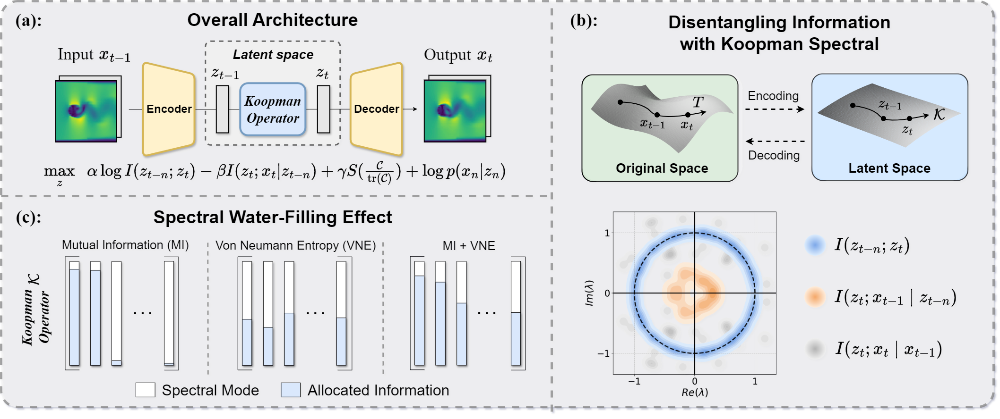

# Information Shapes Koopman Presentation

### Abstract

The Koopman operator provides a powerful framework for modeling dynamical systems and has attracted growing interest in deep learning. Yet its infinite-dimensional nature makes identifying suitable finite-dimensional subspaces challenging, especially for deep architectures. We argue these difficulties are from representation learning, where latent variables fail to balance expressivity and simplicity. This tension is closely related to the information bottleneck (IB) dilemma: constructing compressed representations that are both compact and predictive. Rethinking Koopman learning through this lens, we demonstrate that latent mutual information governs enforcing simplicity, yet an overemphasis on simplicity may induce latent space collapse to few dominant modes. In contrast, expressiveness is sustained by the von Neumann entropy, which prevents such collapse and encourage sufficient modes. This insight leads us to propose an information-theoretic Lagrangian formulation that explicitly balances this tradeoff. Also, we propose a new algorithm based on the Lagrangian formulation that encourages both simplicity and expressiveness, leading to a stable and interpretable Koopman representation. Beyond quantitative evaluations, we further visualize the learned manifolds under our representations, observing empirical results consistent with our theoretical predictions. Finally, we validate our approach across a diverse range of dynamical systems, demonstrating improved performance.

<!-- ### Architecture

 -->

### Code Structure

```bash
INFORMATIONKOOPMAN/
│
├── data/                           # Data loading and preprocessing
│   ├── physical_simulation_Dataset.py
│   └── README.md
│
├── model/                          # Core model implementations
│   └── physical_simulation/        # Physics-based simulation models
│       ├── Cylinder/
│       │   └── cylinder_model.py
│       ├── Dam/
│       │   └── dam_model.py
│       ├── base.py                 # Base model classes
│       └── utils.py                # Utility functions
│
└── train_scripts/                  # Training scripts and configs
    └── physical_simulation/
        ├── cylinder/
        │   ├── cylinder_trainer.py
        │   └── cylinder.yaml
        ├── dam/
        │   ├── dam_trainer.py
        │   └── dam.yaml
        └── trainer.py              # Shared training utilities
```

### Install Dependencies

``` 
pip install -U -r requirements.txt
```

or 

``` 
conda env create -f environment.yml
conda activate InfoKoopman
```

*Note: You may need to install pytorch seperately for GPU support: 

``` pip install torch torchvision torchaudio --index-url https://download.pytorch.org/whl/cu121``` 


## Contact

For questions and feedback, feel free to reach out: Xiaoyuan Cheng (zcahyy1@ucl.ac.uk)

If you encounter any issues, please open an issue on GitHub.